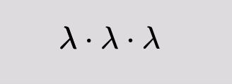

# math-formula-interpolation  

## about  

simple interpolation between formulas.  
(and i really mean **simple**, see [limitations](#limitations)).  

this library uses another library of mine, https://github.com/flurrux/math-layout-engine, which i originally wrote for the purpose of animating formulas.  

## installation  

right now (7.9.2021), i have not yet published a package. sorry about that.  

### parcel issues

there are some issues with imports of font-files in the layout-library which can be resolved by navigating to  
*./node_modules/@flurrux/math-layout-engine/blob/master/src/fonts/load-fonts.ts*  
and changing the following line  

	import fonts from './*.ttf';

to

	import fonts from 'url:./*.ttf';

this is only temporary until i update the parcel version of the layout-engine.  

## examples  

here are a couple of examples to illustrate the notation of formulas.  

the building blocks are exported from the following file  

	import { char, delimit, fraction, mathList, matrix, root, script } from "@flurrux/math-formula-interpolation/src/formula-construction";

there is also a little helper function that animates and renders sequences of formulas:  

	import { animateFormulaSequence } from "@flurrux/math-formula-interpolation/src/formula-sequence-animation";

it has the following signature:  

	async function animateFormulaSequence(ctx: CanvasRenderingContext2D, sequence: FormulaSequence){...}

`sequence` is an array of formula-pairs:  

	type FormulaSequence = [InterpolatableFormulaNode, InterpolatableFormulaNode][]

why is it not simply an array like:  

	type FormulaSequence = InterpolatableFormulaNode[]

in simple cases, we could use a simple array of Formulas but in more complex cases, it is necessary to change ids or custom functions midway. 

### example 1

	*/
	  λ is the character and "λ(1)" is the id.  
	  ids are meant to connect elements that persist between the interpolation.  
	*/
	const l = char("λ", "λ(1)");

	/*
	  this multiplication-dot is meant to fade out.  
	  it doesn't connect to any other element and so it doesn't need an id.
	*/
	const mul = char("*");
	

	//this is the formula that we're starting with
	const src = mathList([
		//λ * λ * λ
		l, mul, l, mul, l,
	]);

	/*
	  λ^3
	  this is the formula that we want to end up with.  
	  the function `script` also takes a sub-script argument which we don't need here and so we just pass undefined instead.
	  l has the same id everywhere, so the three l-elements above are "merged" to this l here.
	*/
	const target = script(
		l, char("3"),
		undefined
	);

	//animate the thing
	animateFormulaSequence(
		ctx, [[src, target]]
	);

### example 2  

	const defaultMatrixStyle: MatrixStyle = {
		type: "D",
		horizontalAlignment: "center",
		colSpacing: 0.6, 
		rowSpacing: 0.6
	};
	const makeMatrixEntry = (i: number, j: number) => script(
		char("M"),
		undefined,
		mathList([
			char(i.toString()),
			char(j.toString())
		]),
		`M_${i}${j}`
	);

	const src = mathList([
		delimit(
			char("[", "["),
			matrix(
				[
					makeMatrixEntry(1, 1), makeMatrixEntry(1, 2),
					makeMatrixEntry(2, 1), makeMatrixEntry(2, 2),
				],
				2, 2, defaultMatrixStyle,
			),
			char("]", "]")
		),
		char("*"),
		delimit(
			char("["),
			matrix(
				[
					char("u", "u"), char("v", "v"),
				],
				1, 2, 
				{
					...defaultMatrixStyle,
					colSpacing: 0.2,
					rowSpacing: 0.2
				}
			),
			char("]")
		)
	]);
	
	const target = delimit(
		char("[", "["),
		matrix(
			[
				mathList([
					makeMatrixEntry(1, 1),
					char("*"),
					char("u", "u"),
					char("+"),
					makeMatrixEntry(2, 1),
					char("*"),
					char("v", "v"),
				]),

				mathList([
					makeMatrixEntry(1, 2),
					char("*"),
					char("u", "u"),
					char("+"),
					makeMatrixEntry(2, 2),
					char("*"),
					char("v", "v"),
				])
			],
			2, 1,
			defaultMatrixStyle,
		),
		char("]", "]")
	);

### example 3  

in addition to an id parameter, you can also pass some additional properties to customize interpolation:  

	{
		interpolate?: InterpolationFunc<B>,
		fadeIn?: FadeFunc<B>,
		fadeOut?: FadeFunc<B>
	}

where  

	type InterpolationFunc<B> = (from: B, to: B, t: number) => B;

	//InterpolationContext contains additional information about the src- and target formulas.  
	type FadeFunc<B> = (node: B, t: number, context: InterpolationContext) => B;

in the following example, i use \`interpolate\` and \`fadeOut\`to move the minus-sign and 1 on a curved path.  

	const src = mathList([
		char("m", "m"),
		char("*"),
		mathList([
			char(
				"-", "-",
				{ interpolate: createBezierPathInterpolation([[0.5, -1.1]]) }
			),
			char(
				"1", undefined,
				{
					fadeOut: (node, t, ctx) => {
						const targetPoint = subtract(
							ctx.targetNode.items[0].position,
							[20, 0]
						);
						const animPoint = interpolatePointByRelCtrlPoints([[0.5, -1.1]])(node.position, targetPoint, t);
						return {
							...fadeOutNodeDefault(t)(node),
							position: animPoint
						}
					}
				}
			)
		])
	]);

	const target = mathList([
		char("-", "-"),
		char("m", "m"),
	]);

## limitations  

currently, elements can only be moved and scaled but not morphed.  

dynamically sized contours like delimiters or radicals do not grow/shrink appropriately when interpolated.  
the reason is that the geometry of the src- and target contour may differ from each other and i have not yet seriously worked on a way to interpolate such shapes. (it should definitely be easier to interpolate between two similar delimiters than any arbitrary shapes.)  

see how the radical on the left side is not growing to accomodate the two symbols x and y:  

it should've looked like this:  

